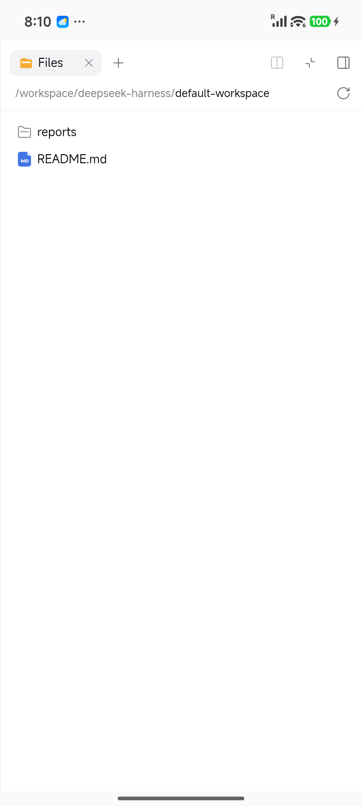

<p align="center">
  
</p>

<h1 align="center">DSH Mobile</h1>

<p align="center"><strong>在 Android 上本地运行 DeepSeek Harness。</strong></p>

<p align="center">
  <a href="https://github.com/meteor149/dsh-mobile/actions/workflows/android.yml"></a>
  
  
  <a href="../LICENSE"></a>
</p>

<p align="center"><a href="../README.md">English</a> · <strong>简体中文</strong></p>

DSH Mobile 是 [DeepSeek Harness](https://github.com/deepseek-ai/deepseek-harness) 的非官方 Android 应用，在应用私有的 Ubuntu ARM64 环境中运行 DSH，并通过内置 WebView 显示界面。

Ubuntu 运行库当前通过 Central snapshot 仓库接入 `io.github.meteor149:ubuntu-runtime:0.3.0-SNAPSHOT`，临时修复 PRoot 的兼容问题。Ubuntu 镜像仍使用 `24.04-1`，proroot 的接入由本应用负责。

## 应用效果

<p align="center">
  
  
  
</p>

<p align="center">Ubuntu 安装 · 首页 · 通用设置（英文界面）</p>

<p align="center">
  
  
</p>

<p align="center">左侧栏 · 右侧栏工作区文件浏览器（英文界面）</p>

## 功能

- 在 Ubuntu 24.04 ARM64 中运行 DSH，并校验运行时文件的完整性。
- 支持 PRoot、proroot 和 chroot，由前台服务管理本地运行时。
- 适配手机屏幕，提供侧边栏导航、可横向滚动的设置分类和不被软键盘遮挡的输入区。
- 支持边缘手势，呼出 Web UI 自带的左右侧栏。
- 支持将 Web UI 中的工作区文件下载到手机，提供传输进度和取消操作。
- 支持记住运行方式，在重新打开应用时自动启动 DSH。
- Ubuntu 和工作区数据保存在应用私有目录。
- 通过带身份验证的本地网关访问 Web UI。

## 安装与使用

需要运行 Android 9 或更高版本的 ARM64 设备。只有 chroot 需要 Root 权限。

从 [Releases](https://github.com/meteor149/dsh-mobile/releases) 下载 APK。
开发版可在成功的 [GitHub Actions 构建](https://github.com/meteor149/dsh-mobile/actions/workflows/android.yml) 的 **Artifacts** 中下载。

1. 安装 APK，然后在应用内安装运行时。
2. 选择运行方式，建议先使用 PRoot；chroot 需要在 Root 管理器中授权。
3. 启动 DeepSeek Harness，打开 Web UI。
4. 在设置中配置模型服务商和 API 密钥。

在引导界面启用**记住并自动启动**后，重新打开应用时会使用选定的运行方式自动启动 DSH，应用进程被结束后再次打开也会生效。

首次使用时，DSH 会在 `/workspace/deepseek-harness/default-workspace` 创建默认工作区，文件保存在应用私有数据中，并在各运行方式之间共享。

## 手势与导航

- 从屏幕左边缘中部向右滑动，打开左侧栏。
- 从屏幕右边缘中部向左滑动，打开新版自带的右侧栏，可浏览工作区文件或打开终端。
- 点击左侧栏外的阴影区域可关闭左侧栏；右侧栏使用其自带的工具栏控件关闭。

手势需要从屏幕边缘开始。页面中部的横向滑动和纵向滚动不会呼出侧栏。

Web UI 会消费系统返回操作，保持当前页面和前台状态。运行时可通过通知停止。

## 将工作区文件保存到手机

DSH 生成的文件保存在应用的 Ubuntu 工作区中，可通过 Web UI 导出到手机使用。

1. 点击 Web UI 中文件的下载按钮。
2. 在 Android 系统“保存到”界面选择**下载目录**、其他文件夹或文档存储服务，确认文件名后保存。
3. 在应用中查看传输进度；传输过程中可以取消。

保存后，可通过手机文件管理器或其他应用打开导出的文件。

## 运行方式

三种方式共用 Ubuntu 环境和工作区数据，切换时无需重新安装 Ubuntu。

| 方式 | 需要 Root | 说明 |
|---|---|---|
| PRoot | 否 | 默认方式，通过 ptrace 转换系统调用。 |
| proroot | 否 | 实验性方案，通过 LD_PRELOAD 转换避开 ptrace 开销，未开源。 |
| chroot | 是 | 使用内核 chroot 机制，兼容性取决于内核和 Root 配置。 |

proroot 使用 [coderredlab/proroot](https://github.com/coderredlab/proroot) 的预编译二进制，遵循其[上游许可证](../app/src/main/assets/licenses/proroot-LICENSE.txt)。

PRoot 和 proroot 使用 Android 应用 UID 运行，不能作为安全边界。
chroot 以 Root 身份运行 Ubuntu，请仅在可信设备上使用。

## 构建

需要 JDK 21 和 Android SDK 36。构建运行时还需要 Node.js、启用 BuildKit 的 Docker 和 ARM64 模拟支持（QEMU），详见[运行时构建说明](../runtime/README.md)。
Ubuntu 镜像从 Maven Central 下载，运行库当前使用 Central snapshot 仓库。

```bash
./gradlew buildRuntime
./gradlew :app:assembleDebug
```

APK 输出至 `app/build/outputs/apk/debug/app-debug.apk`。
缺少运行时制品时，应用以诊断模式构建，无法启动 DSH。

运行检查：

```bash
./gradlew :dsh-runtime:testDebugUnitTest :shared:testDebugUnitTest :app:testDebugUnitTest
```

Node.js、DSH 和网关由内部模块 `:dsh-runtime` 维护。可复用的 Ubuntu 库分别位于 [android-ubuntu-runtime](https://github.com/meteor149/android-ubuntu-runtime) 和 [android-ubuntu-image](https://github.com/meteor149/android-ubuntu-image)。

发布时修改 [`gradle.properties`](../gradle.properties) 中的 `APP_VERSION_NAME`，递增 `APP_VERSION_CODE`，再推送对应的 `v<版本号>` 标签。GitHub Actions 会构建并发布签名 APK。

## 许可证

DSH Mobile 源代码使用 [Apache License 2.0](../LICENSE)。
打包的 proroot 二进制未开源，使用[独立的上游许可证](../app/src/main/assets/licenses/proroot-LICENSE.txt)。
