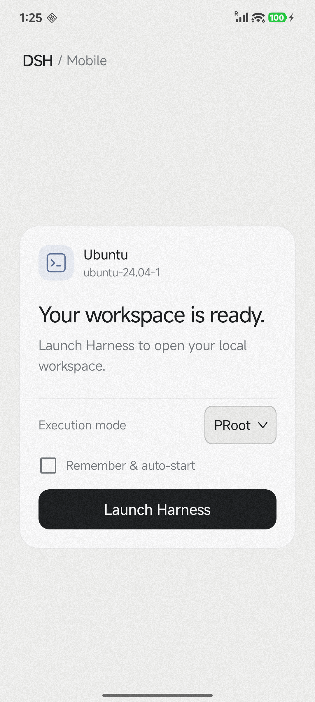
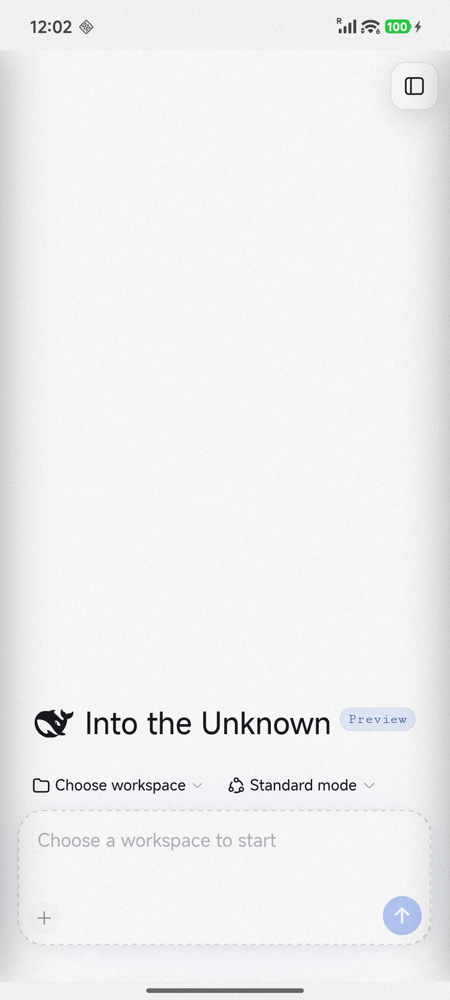
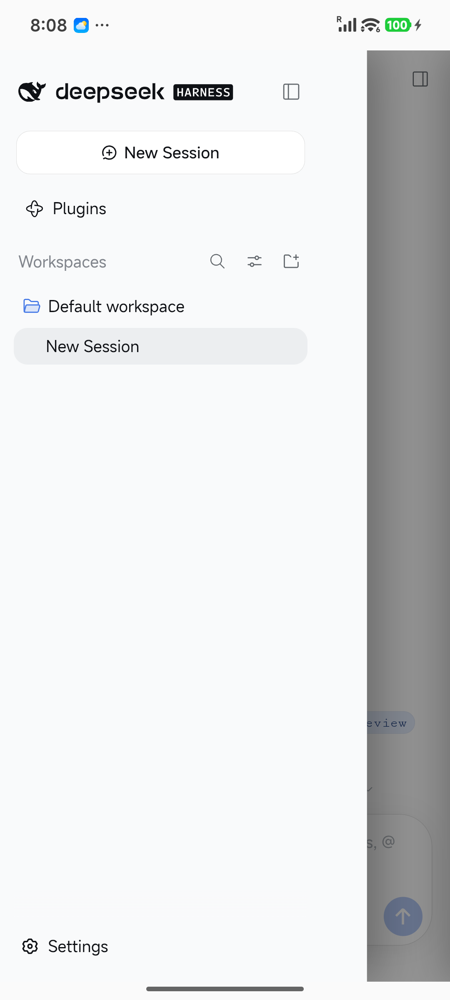
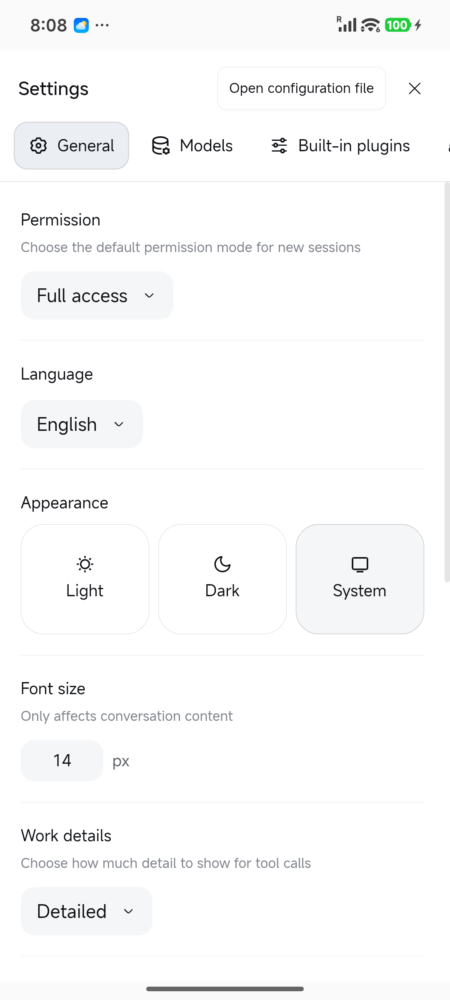
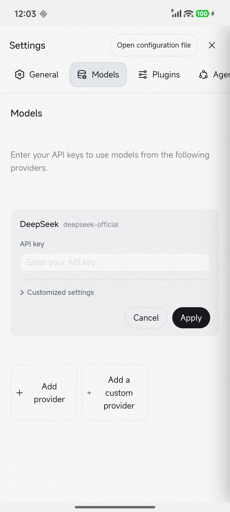

<p align="center">
  
</p>

<h1 align="center">DSH Mobile</h1>

<p align="center"><strong>Run DeepSeek Harness locally on Android.</strong></p>

<p align="center">
  <a href="https://github.com/meteor149/dsh-mobile/actions/workflows/android.yml"></a>
  
  
  <a href="LICENSE"></a>
</p>

<p align="center"><strong>English</strong> · <a href="Docs/README.zh-CN.md">简体中文</a></p>

DSH Mobile is an unofficial Android host for
[DeepSeek Harness](https://github.com/deepseek-ai/deepseek-harness). It runs the
official DSH Web UI inside an app-private Ubuntu ARM64 environment and opens it
in the app’s WebView.

## App preview

<p align="center">
  
</p>

<p align="center">Ubuntu setup, execution mode selection, and automatic launch.</p>

<p align="center">
  
  
</p>

<p align="center">
  
  
</p>

<p align="center">English Web UI on an ARM64 Android device: home, sidebar, general settings, and model settings.</p>

## Features

- Runs DSH in Ubuntu 24.04 ARM64, with checksum-verified runtime files.
- Supports PRoot, proroot, and chroot, managed by a foreground service.
- Adapts the Web UI for phones, with sidebar navigation, scrollable settings tabs, and an input area that stays visible above the keyboard.
- Keeps Ubuntu and workspace data in the app-private directory.
- Serves the Web UI through an authenticated local gateway.

## Install and run

Requires an ARM64 device running Android 9 or newer. Root is only needed for chroot.

Download the APK from [Releases](https://github.com/meteor149/dsh-mobile/releases).
Development builds are available under **Artifacts** in successful
[GitHub Actions runs](https://github.com/meteor149/dsh-mobile/actions/workflows/android.yml).

1. Install the APK, then install the runtime from the app.
2. Choose an execution mode. Start with PRoot; chroot requires root-manager authorization.
3. Start DeepSeek Harness and open the Web UI.
4. Configure a model provider and API key in Settings.

Back navigates within the Web UI when history is available; otherwise it sends
the app to the background. The runtime continues until stopped from the app or notification.

## Execution modes

All modes share the same Ubuntu environment and workspace data. Switching modes
does not require reinstalling Ubuntu.

| Mode | Root required | Notes |
|---|---|---|
| PRoot | No | Default. Uses ptrace-based system call translation. |
| proroot | No | Experimental. Uses LD_PRELOAD translation to avoid ptrace overhead. Not open source. |
| chroot | Yes | Uses the kernel chroot mechanism; compatibility depends on the kernel and root configuration. |

proroot uses prebuilt binaries from [coderredlab/proroot](https://github.com/coderredlab/proroot)
under its [upstream license](app/src/main/assets/licenses/proroot-LICENSE.txt).

PRoot and proroot run as the Android app UID and are not security boundaries.
chroot runs Ubuntu as root; use it only on a trusted device.

## Build

Requires JDK 21 and Android SDK 36. Building the runtime also requires Node.js,
Docker with BuildKit, and ARM64 emulation (QEMU); see [runtime build details](runtime/README.md).
Ubuntu libraries are downloaded from Maven Central by default.

```bash
./gradlew buildRuntime
./gradlew :app:assembleDebug
```

Output: `app/build/outputs/apk/debug/app-debug.apk`.
Without runtime artifacts, the app builds in diagnostic mode and cannot start DSH.

Run checks with:

```bash
./gradlew :dsh-runtime:testDebugUnitTest :shared:testDebugUnitTest :app:testDebugUnitTest
```

Node.js, DSH, and the gateway are maintained in `:dsh-runtime`. The reusable Ubuntu
libraries are maintained in [android-ubuntu-runtime](https://github.com/meteor149/android-ubuntu-runtime)
and [android-ubuntu-image](https://github.com/meteor149/android-ubuntu-image).

For releases, update `APP_VERSION_NAME` and increment `APP_VERSION_CODE` in
[`gradle.properties`](gradle.properties), then push the matching `v<version>` tag.
GitHub Actions builds and publishes the signed APK.

## License

DSH Mobile source code is licensed under [Apache License 2.0](LICENSE).
The bundled proroot binaries are not open source and use a
[separate upstream license](app/src/main/assets/licenses/proroot-LICENSE.txt).
